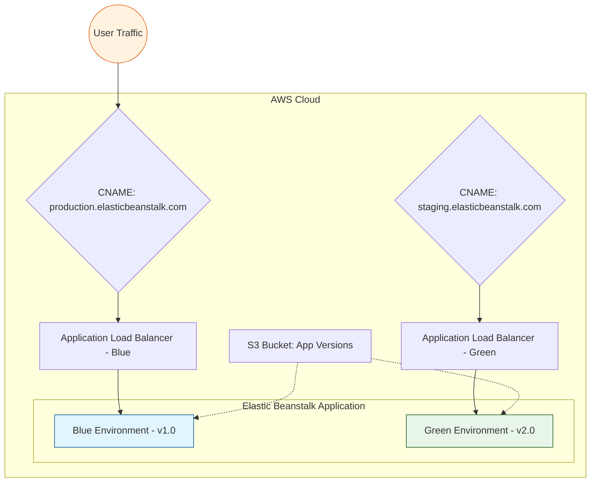

# AWS Elastic Beanstalk Blue-Green Deployment with Terraform

This project demonstrates a **Blue-Green Deployment** strategy using AWS Elastic Beanstalk and Terraform. It allows for zero-downtime deployments by maintaining two identical environments (Blue and Green) and swapping their CNAMEs to redirect traffic.

## 🏗️ Architecture

The following diagram illustrates the Blue-Green deployment workflow:



### Key Components:
- **Terraform**: Provisions all AWS infrastructure.
- **AWS Elastic Beanstalk**: Manages the application environments.
- **Application Load Balancer (ALB)**: Distributes traffic within each environment.
- **S3**: Stores application version artifacts (.zip files).
- **CNAME Swap**: The mechanism used to switch traffic between environments.

## 🚀 Getting Started

### Prerequisites
- [Terraform](https://www.terraform.io/downloads.html) (>= 1.0)
- [AWS CLI](https://aws.amazon.com/cli/) configured with appropriate credentials
- `zip` utility (for packaging apps)

### 1. Package the Applications
Before deploying, you need to package the Node.js applications into ZIP files:

```bash
# Using the provided script
./package-apps.sh
# OR on Windows
.\package-apps.ps1
```

### 2. Initialize and Deploy
```bash
terraform init
terraform plan
terraform apply
```

### 3. Perform Blue-Green Swap
Once both environments are healthy, you can swap the traffic:

```bash
./swap-environments.sh
# OR on Windows
.\swap-environments.ps1
```

## 📂 Project Structure

- `main.tf`: Core EB application and IAM configurations.
- `blue-environment.tf`: Configuration for the "Blue" (Production) environment.
- `green-environment.tf`: Configuration for the "Green" (Staging) environment.
- `variables.tf`: Input variables.
- `outputs.tf`: Useful outputs including environment URLs and swap instructions.
- `app-v1/`, `app-v2/`: Sample Node.js applications.
- `package-apps.*`: Scripts to zip the application code.
- `swap-environments.*`: Scripts to perform the CNAME swap via AWS CLI.

## 🧹 Cleanup
To avoid ongoing charges, destroy the resources when finished:

```bash
terraform destroy
```

## 📄 License
This project is licensed under the MIT License - see the [LICENSE](LICENSE) file for details.
