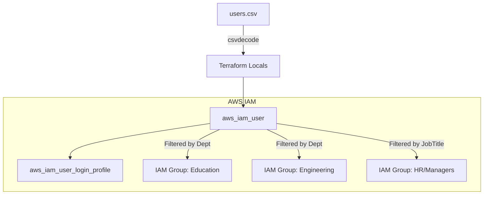

# IAM User Management with Terraform

This project automates the creation and management of AWS IAM Users and Groups using Terraform. It reads user data from a CSV file and dynamically assigns users to groups based on their department or job title.

## Features
- **Dynamic User Provisioning**: Automatically creates IAM users from a central `users.csv` file.
- **Automated Group Membership**: Assigns users to IAM groups dynamically based on their department or seniority (Job Title).
- **Secure Access**: Generates login profiles for all users with a mandatory password reset on first login.
- **Resource Tagging**: Applies consistent tags (`DisplayName`, `Department`, `JobTitle`) for better resource management and billing.

## Architecture Diagram



## Prerequisites
- [Terraform](https://www.terraform.io/downloads.html) installed (v1.0 or later).
- [AWS CLI](https://aws.amazon.com/cli/) configured with administrative credentials.
- A `users.csv` file in the root directory.

## File Structure
- `main.tf`: Defines the IAM users and their login profiles.
- `groups.tf`: Defines the IAM groups and dynamic membership logic.
- `local.tf`: Decodes the `users.csv` file into Terraform variables.
- `data.tf`: Fetches contextual data (like AWS Account ID).
- `output.tf`: Displays important information after deployment.
- `users.csv`: Source of truth for user identities.

## Usage

1. **Initialize Terraform**:
   ```bash
   terraform init
   ```

2. **Review the Plan**:
   ```bash
   terraform plan
   ```

3. **Deploy the Infrastructure**:
   ```bash
   terraform apply
   ```

4. **Clean Up**:
   ```bash
   terraform destroy
   ```

## CSV Format Reference
The `users.csv` file should follow this header structure:
```csv
first_name,last_name,department,job_title
```
