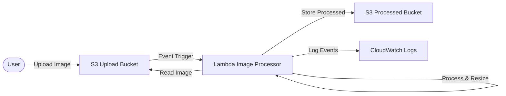

# AWS Lambda Image Processor

A serverless image processing pipeline built with AWS Lambda, S3, and Terraform. This project automatically processes images uploaded to an S3 bucket (e.g., resizing, filtering) and saves the results to a destination bucket.

## Architecture



## Features

- **Automated Triggering**: Lambda function is triggered instantly upon S3 object creation.
- **Image Manipulation**: Uses the `Pillow` library for high-quality image processing.
- **Infrastructure as Code**: Entire AWS stack is managed via Terraform.
- **Dockerized Build**: Lambda layers are built inside Docker to ensure compatibility with AWS Lambda's Linux environment.

## Prerequisites

Before you begin, ensure you have the following installed:
- [AWS CLI](https://aws.amazon.com/cli/) configured with appropriate credentials.
- [Terraform](https://www.terraform.io/downloads.html) (v1.0+).
- [Docker](https://www.docker.com/products/docker-desktop) (required for building the Lambda layer).
- Bash shell (Linux, macOS, or WSL on Windows).

## Project Structure

```text
.
├── lambda/                 # Lambda function source code
│   ├── lambda_function.py  # Image processing logic
│   └── requirements.txt    # Python dependencies
├── scripts/                # Helper scripts for deployment
│   ├── build_layer_docker.sh
│   ├── deploy.sh
│   └── destroy.sh
└── terraform/              # Terraform configuration files
    ├── main.tf             # Primary resources
    ├── variables.tf        # Input variables
    └── outputs.tf          # Stack outputs
```

## Steps to Follow

### 1. Clone the Repository
```bash
git clone <your-repo-url>
cd lambda-image-processor
```

### 2. Deploy the Infrastructure
Run the deployment script. This script will build the Lambda layer using Docker, initialize Terraform, and apply the configuration.

```bash
chmod +x scripts/deploy.sh
./scripts/deploy.sh
```

### 3. Verify Deployment
Once the script completes, it will output the names of the created S3 buckets and the Lambda function.

### 4. Test the Pipeline
Upload an image to the source bucket to trigger the processing:

```bash
aws s3 cp your-image.jpg s3://<upload-bucket-name>/
```

Check the destination bucket for the processed results:

```bash
aws s3 ls s3://<processed-bucket-name>/
```

### 5. Cleanup
To remove all resources created by this project:

```bash
chmod +x scripts/destroy.sh
./scripts/destroy.sh
```

## License
MIT
